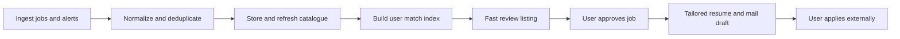
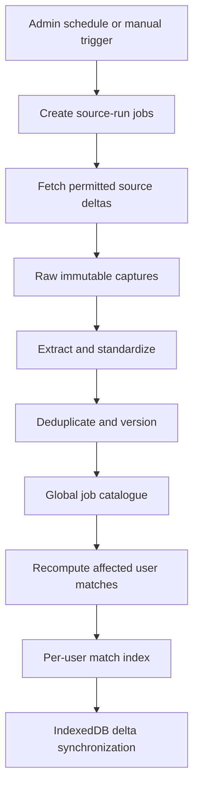
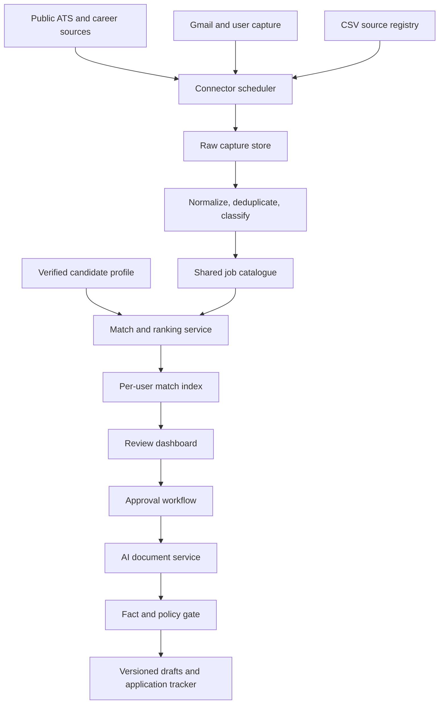

# Job-hunt Enterprise Product Roadmap

**Version:** 1.0  
**Planning date:** 2 October 2026  
**Delivery horizon:** Four weeks to controlled public beta  
**Target branch:** `job-hunt-standalone`  
**Source capabilities:** selectively ported from `main`

## 1. Executive objective

Build Job-hunt as a candidate-controlled, multi-tenant job-search intelligence platform that continuously discovers legitimate public vacancies, matches them to a verified candidate profile, produces fact-grounded application material, and keeps the candidate in control of every application and outbound message.

The four-week target is a **controlled public beta**, not an unrestricted mass-scraping or auto-application product. **Data ingestion is the first product priority:** the system must continuously collect, normalize, deduplicate and refresh jobs before document-generation features are expanded. The launch must support a complete candidate journey for approved data sources while keeping restricted portals behind user-authorized capture, email alerts, partner APIs, or manual import.

### North-star outcome

> A candidate can create a verified career profile, receive a continuously refreshed list of high-fit jobs, inspect the evidence behind each match, generate an accurate tailored resume and cover letter, and record the application—without surrendering account credentials or allowing the system to submit anything automatically.

### Product principles

1. **Candidate control:** drafts, applications and outreach always require explicit review.
2. **Facts before fluency:** generated claims must be traceable to verified candidate facts.
3. **API and public-feed first:** use authorized APIs, public ATS endpoints, employer career pages, Gmail alerts and candidate-initiated capture before browser automation.
4. **One ingestion, many matches:** ingest a posting once into a shared normalized catalogue; calculate tenant-specific matches separately.
5. **Evidence and freshness:** retain source URL, capture timestamp, content hash and liveness state.
6. **Deterministic core, AI enrichment:** eligibility, deduplication and workflow gates remain deterministic; LLMs enrich extraction, explanation and writing.
7. **No silent action:** no automatic application submission, email sending or LinkedIn messaging in the beta.
8. **Honest capability labels:** UI and API distinguish `live`, `beta`, `partner_required`, `user_capture` and `planned`.

### Mandatory product sequence

No resume, cover letter or outreach draft is generated before a user selects or approves a job. Scanning and matching are decoupled: ingestion refreshes the shared catalogue on a schedule, while matching operates over stored jobs.

## 2. Goals converted into measurable outcomes

| ID | Goal | Four-week beta outcome | Success measure |
|---|---|---|---|
| G1 | Tailor resumes for selected jobs | Generate versioned resume, cover letter and optional form-answer drafts from verified facts and an archived job description | 100% generated claims have provenance; zero document generation without approval |
| G2 | Create job alerts across portals | Saved searches, email-alert ingestion, public ATS feeds and scheduled employer-career scans | New permitted-source jobs visible within 60 minutes; failed-source alerts raised within 15 minutes |
| G3 | Extract and review job postings | Normalized catalogue with title, company, location, posted date, description, responsibilities and apply URL | ≥95% required-field completeness for supported sources; ≥99% duplicate suppression |
| G4 | Convert hiring/feed posts into outreach drafts | Candidate-initiated post capture, job/hiring-post classification, recruiter/contact extraction and review-only email draft | Every draft linked to captured evidence and candidate approval; no send endpoint |
| G5 | Maintain company career-source catalogue and CSV | Versioned source registry with CSV import/export, health status and scheduled scans | CSV schema validates before import; source coverage and failures visible in admin UI |
| G6 | Use agents, LLMs, Jev and MCP | Policy-controlled agent orchestration with provider-agnostic AI gateway and connector contracts | Every run has correlation ID, cost/latency record, model/provider and input/output provenance |
| G7 | Scale ingestion and users | Shared job catalogue, distributed workers, leases, retries, backpressure, caching and per-user match materialization | Initial target: 10,000 active users, 1 million active jobs, 99.5% beta API availability |
| G8 | Avoid scan-on-demand dependency | Scheduled incremental ingestion and per-user ranking over stored jobs | Dashboard reads indexed matches; user request never initiates a full global crawl |

### Launch KPIs

- Onboarding completion: ≥70% of users who start profile setup.
- Time to first relevant job: ≤5 minutes after profile completion when catalogue coverage exists.
- Match usefulness: ≥60% of top-10 jobs saved, opened or explicitly rated relevant during beta.
- Tailoring completion: ≥40% of reviewed jobs reach a generated-document preview.
- Duplicate rate: <1% in visible active postings.
- Stale/closed-job rate in top results: <5% after liveness verification.
- Unsupported-claim escape rate: 0 in the gold evaluation set.
- Ingestion success: ≥98% for supported public ATS adapters.
- P95 dashboard API latency: <500 ms; P95 document-job enqueue latency: <250 ms.
- Critical tenant-isolation failures: 0.

## 3. Scope boundary

### Four-week public-beta scope

- Clerk authentication, onboarding and verified career profile.
- Resume upload and structured fact extraction with explicit user confirmation.
- Saved searches and job preferences.
- Shared normalized job catalogue.
- Public ATS adapters: Greenhouse, Lever and Ashby; Workday where a permitted public endpoint is supportable.
- Employer career-source registry and CSV import/export.
- Gmail job-alert ingestion with narrow read-only scope and production gate.
- Candidate-initiated browser/extension capture for job pages and hiring posts.
- Deterministic hard filters and explainable match score.
- LLM-assisted job extraction, classification, summaries and application-document generation.
- Review inbox, saved/rejected status, application handoff and application tracker.
- Versioned resume, cover-letter and outreach-email drafts.
- Source health, ingestion operations, audit history, usage metering and feature flags.
- Responsive dashboard based on the mature information architecture in `main`.

### Explicitly outside the beta

- Automated application submission or clicking Apply/Send.
- Automated LinkedIn/Naukri/Indeed login using stored user passwords.
- Unapproved scraping that bypasses robots, rate limits, CAPTCHAs or access controls.
- Background extraction of a user's private LinkedIn feed without a permitted integration or candidate-initiated capture.
- Unrestricted outbound email or recruiter messaging.
- Fully autonomous career decisions.
- Native mobile applications; deliver an installable responsive PWA first.
- Training a proprietary foundation model.

## 4. Source acquisition strategy

Every connector must declare its acquisition mode, permissions, retention, refresh policy and implementation status.

### Admin-controlled daily ingestion model

The admin owns the global ingestion schedule and can also trigger an individual source run manually. A default daily refresh runs for all enabled sources, while high-change public ATS feeds may use shorter safe intervals. A manual trigger queues work through the same audited worker path; it never executes a long crawl inside the admin HTTP request.

Admin capabilities:

- Enable, disable or quarantine a source.
- Configure schedule, safe concurrency, geographic scope and job-title scope.
- Trigger one source, a source group or all due sources.
- Preview estimated work before a manual trigger.
- Inspect run totals: fetched, new, updated, unchanged, duplicated, closed and failed.
- Retry failed partitions or move unrecoverable items to a dead-letter queue.
- Reprocess historical raw captures after a parser or taxonomy upgrade without refetching the source.
- View source freshness, last success, consecutive failures and current rate-limit state.
- Roll back a bad normalization/parser version and restore the preceding job version.

The admin trigger requires an idempotency key and creates an immutable audit event containing the actor, source scope, reason, configuration version and resulting run ID.

### Global and personal source separation

- **Global catalogue:** public ATS feeds, permitted employer career pages and admin CSV sources are ingested once and shared across tenants.
- **Personal catalogue additions:** Gmail alerts, user-captured URLs and hiring/feed posts are private to that user unless an explicit policy safely promotes a public vacancy into the global catalogue.
- **Matching:** global jobs and the user's private captures are evaluated against that user's verified skills and preferences.
- **Isolation:** Gmail-derived evidence, private post content and user-specific actions never become visible to another tenant.

### Standard job-ingestion template

All connectors must emit this canonical contract before a job becomes searchable.

| Group | Required/optional fields |
|---|---|
| Identity | `canonical_job_id`, `source_id`, `external_job_id`, `source_type`, `source_url`, `apply_url` |
| Employer | `company_name`, `company_canonical_id`, `company_alias`, `company_career_url` |
| Role | `job_title`, `normalized_title`, `designation_family`, `seniority`, `employment_type`, `department` |
| Location | `location_raw`, `city`, `state`, `country`, `work_mode`, `remote_eligible` |
| Dates | `posted_at`, `first_seen_at`, `last_seen_at`, `last_verified_at`, `expires_at` |
| Content | `description_raw`, `description_clean`, `responsibilities`, `requirements`, `preferred_qualifications` |
| Skills | `required_skills`, `preferred_skills`, `experience_min_years`, `experience_max_years` |
| Compensation | `salary_min`, `salary_max`, `currency`, `period`, `compensation_text` |
| Provenance | `content_hash`, `parser_version`, `capture_id`, `captured_at`, `acquisition_mode`, `evidence_status` |
| Lifecycle | `status`, `closed_at`, `duplicate_of`, `quality_score`, `field_completeness`, `quarantine_reason` |

Required searchable fields are job title, company, source/apply URL, source identity, first/last seen times and a usable description or excerpt. Missing location or posted date is recorded as unknown and reduces confidence; it must not be invented by an LLM.

| Source class | Beta method | Refresh | Storage policy |
|---|---|---|---|
| Greenhouse, Lever, Ashby public boards | Public posting API/feed adapter | 15–60 minutes, conditional requests where available | Full normalized posting plus permitted source evidence |
| Employer career sites | Approved structured feed, sitemap/JSON-LD or source-specific adapter | 1–6 hours based on change frequency | Normalized posting, source URL, hash and freshness metadata |
| Gmail job alerts | User OAuth, read-only, allowlisted labels/senders | Incremental history/message cursor | Derived job data; minimum necessary email evidence with retention control |
| LinkedIn/Naukri/Indeed alerts | Prefer email alerts, partner APIs and user-authorized capture | Event/candidate initiated | Do not retain credentials; store only necessary captured evidence |
| LinkedIn feed hiring posts | Browser extension/share-to-Job-hunt action initiated by candidate | On demand | Captured post, source URL, author/contact evidence and timestamp |
| CSV/company registry | Admin import with schema validation | Scheduled health checks | Source metadata and scan state; version every import |
| Manual job URL/text | Candidate submits URL or pastes description | On demand | Archived evidence tied to user and job |

LinkedIn access cannot be assumed: most Talent APIs require explicit approval and the Job Posting API is partner-restricted. Indeed integrations are governed by partner/API terms. Consequently, the product must not promise unrestricted portal scraping. Public ATS APIs are the scalable first-party path: Greenhouse, Lever and Ashby expose job-posting interfaces suitable for external career listings.

## 5. Target architecture

### Technology decisions

| Area | Decision |
|---|---|
| Application shape | Retain FastAPI modular monolith for the beta; isolate modules by interfaces, not network calls |
| Frontend | React + Vite + TypeScript + React Router; adopt the main branch's workflow/information architecture, not its local-file assumptions |
| Canonical database | Supabase PostgreSQL with tenant columns, RLS defense-in-depth and migrations |
| Offline/cache | IndexedDB stores recent matches, filters and pending client actions; it is never the source of truth |
| Bulk interchange | CSV/XLSX for registry import/export and user exports; never the live datastore |
| Queue | PostgreSQL queue for beta with atomic `SKIP LOCKED` leases; prepare adapter for Redis/SQS when load justifies it |
| Search | PostgreSQL full-text/trigram initially; add pgvector for semantic candidate/job embeddings after deterministic scoring is stable |
| Cache | Redis-compatible cache for rate limits, distributed locks, hot searches and provider budgets |
| AI gateway | Provider-neutral interface: Groq for low-latency generation, Gemini/OpenAI-compatible/Jev adapters behind policy and feature flags |
| Connector interface | Typed connector SDK; MCP used for permissioned external tools and optional integrations, not as the only internal job runner |
| Object storage | Supabase Storage for source resumes and generated artifacts, with tenant paths and signed URLs |
| Observability | OpenTelemetry traces, structured redacted logs, metrics, alerts and product events |
| Deployment | Immutable web/API/worker images; managed Postgres; TLS proxy/load balancer; separate UAT and production environments |

### IndexedDB cache design

IndexedDB provides the quick listing experience requested for web and PWA users, but it mirrors server-authorized data rather than replacing the shared database.

| IndexedDB store | Contents | Refresh/invalidation |
|---|---|---|
| `job_summaries` | Recently retrieved normalized jobs needed for list cards | Delta sync by server catalogue version and `updated_at` |
| `user_matches` | Current user's score, confidence and factor summary | Invalidated when profile version or ranking version changes |
| `saved_filters` | Titles, skills, locations, work modes, salary and freshness preferences | Local-first, synchronized to `saved_searches` |
| `review_actions` | Pending save/reject/review actions created while offline | Idempotent outbox replay after reconnection |
| `sync_metadata` | Tenant ID, last cursor, schema version and last successful sync | Reset on logout, tenant change or incompatible schema |

Rules:

- Never store OAuth tokens, service credentials or full Gmail messages in IndexedDB.
- Partition every key by authenticated user and clear tenant data at sign-out.
- Encrypt particularly sensitive local artifacts where browser capabilities permit; do not cache complete resumes by default.
- The API remains authoritative during conflicts; offline actions carry idempotency keys.
- Use paginated/delta synchronization rather than downloading the entire catalogue to every device.

### Responsibility for fast matching

These technologies have distinct roles:

- **Deterministic/ML ranking service:** performs the authoritative match using verified skills, title family, seniority, experience, location, work mode, salary, freshness and user feedback.
- **Jev/LLM gateway:** extracts difficult unstructured fields, maps synonyms, optionally creates embeddings/reranking features and explains the match. It never independently decides eligibility or fabricates missing fields.
- **PostgreSQL match index:** stores versioned user–job scores so the dashboard does not recompute every job on every request.
- **IndexedDB:** caches only the current user's authorized top matches and preferences for fast startup/offline use.

The recommended ranking pipeline is: hard filters → deterministic weighted score → bounded semantic/ML rerank → diversity/freshness policy → versioned match record. Every displayed explanation must be reconstructable from stored features.

### Core bounded modules

1. **Identity & tenancy:** users, organizations, roles, sessions and entitlements.
2. **Career profile:** resumes, verified facts, skills, roles, location, compensation and notice period.
3. **Source registry:** companies, career URLs, connector type, terms classification, health and schedule.
4. **Ingestion:** connector runs, raw captures, cursors, retries, dead letters and freshness.
5. **Job catalogue:** canonical companies/jobs, descriptions, versions, liveness and deduplication.
6. **Matching:** eligibility filters, deterministic score, optional semantic similarity, explanations and feedback.
7. **Review workflow:** inbox state machine, approvals, saved/rejected jobs and apply handoff.
8. **Documents:** job-specific resume, cover letter, application answers, outreach drafts and versioning.
9. **Applications:** stages, events, follow-ups, interviews and outcomes.
10. **Operations:** audit, source health, usage, quotas, admin, feature flags and incident controls.

## 6. Data model

### Shared catalogue tables

- `source_definitions`: source name, type, base URL, acquisition policy, schedule and status.
- `source_runs`: cursor, started/finished times, counts, errors and retry state.
- `raw_captures`: immutable source response/body, source key, content hash and capture timestamp.
- `companies`: canonical company identity and aliases.
- `jobs`: canonical active vacancy and normalized fields.
- `job_versions`: description/version history, source evidence and hash.
- `job_sources`: many-to-one mappings from source posting to canonical job.
- `job_liveness`: last verified time, state and evidence.

### Tenant-owned tables

- `candidate_profiles`, `resumes`, `resume_versions` and `verified_facts`.
- `saved_searches` and `notification_preferences`.
- `job_matches`: user, job, score, confidence, feature breakdown and ranking version.
- `review_items`, `approval_tasks` and `state_events`.
- `tailored_documents` and `document_claims` with provenance.
- `applications`, `application_events`, `follow_ups` and `interviews`.
- `source_accounts`, `consents`, `audit_events` and `usage_counters`.

### Deduplication key hierarchy

1. Source + external posting ID.
2. Normalized canonical/apply URL.
3. Company + requisition ID.
4. Company + normalized title + location + description fingerprint.
5. Semantic near-duplicate review queue; never auto-merge low-confidence cases.

## 7. Agent architecture

Agents are named responsibilities with typed inputs, allowed tools, budgets and approval requirements. They are not unrestricted autonomous processes.

| Agent | Responsibility | AI use | Write permission |
|---|---|---|---|
| Vishwakarma | Orchestration and state transitions | None required | Workflow state only, with transition guards |
| Narada | Source discovery and capture | Classification/extraction fallback | Raw capture and source-run records |
| Ganesha | Hard eligibility filters | None | Qualification decision |
| Arjuna | Match ranking and explanation | Optional semantic similarity/explanation | Match record and ranking features |
| Brihaspati | Company/job analysis | Retrieval-grounded analysis | Cited analysis artifact |
| Saraswati | Resume, cover letter and application answers | Groq/Jev/provider gateway | Draft document versions only after approval |
| Dharma | Claim provenance, privacy and policy checks | Optional verifier, deterministic rules authoritative | Pass/block decision; cannot rewrite evidence |
| Hanuman | Recruiter/contact evidence extraction | Entity extraction | Candidate-reviewed contact suggestions |
| Krishna | Outreach email subject/body | Grounded drafting | Draft only; no send permission |
| Skanda | Interview preparation | Grounded question/answer coaching | Prep artifacts only |
| Lakshmi | Funnel and outcome analytics | Summary only | Aggregate insights, no profile fact mutation |

### AI gateway requirements

- JSON-schema-constrained outputs and validation.
- Prompt version, model, provider, token/latency/cost and correlation ID recorded.
- Provider timeout, circuit breaker, retry and safe fallback.
- PII minimization and configurable provider routing.
- No raw OAuth token, service key or unrelated email content in prompts.
- Evaluation sets for extraction accuracy, match explanations and unsupported claims.
- Jev remains an optional adapter until accuracy, supportability and total cost are benchmarked against Groq and the deterministic path.

## 8. UX and navigation

Use the richer `main` branch workflow model while keeping the standalone branch's multi-tenant web architecture.

### Desktop navigation

- **Home:** match summary, new jobs, source freshness, pending approvals and recommended next action.
- **Discover:** searchable catalogue, saved searches, filters, company sources and job detail.
- **Review Inbox:** strong matches, hiring posts and evidence-first approval decisions.
- **Applications:** kanban/list stages, follow-ups, interviews and outcomes.
- **Documents:** master resume, verified facts and tailored versions.
- **Career Intelligence:** match feedback, skill gaps, funnel and company insights.
- **Sources:** Gmail, browser capture, career boards and source health.
- **Settings:** profile, preferences, privacy, notifications, plans and exports.
- **Admin:** source operations, jobs, users, usage, feature flags and audit/search diagnostics.

### Mobile navigation

- Home, Discover, Review, Applications and Profile.
- Global action button: add job URL, capture post, upload resume or import CSV.
- Filters as a bottom sheet; document review is full-screen.

### Job-detail requirements

- Source and last-verified timestamp.
- Title, company, location, work mode, posted date and apply URL.
- Responsibilities, requirements, compensation when present and archived description.
- Overall score, confidence, factor breakdown, matched/missing skills and hard-filter results.
- Evidence citations and duplicate/source indicators.
- Save, reject, tailor and open employer apply page actions.

## 9. Agile operating model

### Cadence

- Four one-week sprints, Monday–Friday.
- Monday: planning, capacity confirmation, risk review and API-contract freeze for that sprint.
- Daily: 15-minute stand-up plus asynchronous blocker log.
- Wednesday: product/architecture checkpoint and test-evidence review.
- Thursday: feature freeze for the sprint and regression/UAT build.
- Friday: demo, acceptance, retrospective, production/UAT release and next-sprint refinement.
- Pull requests remain small, linked to a story, reviewed by one engineer and validated by CI.

### Definition of Ready

A story has a user, outcome, acceptance criteria, API/data impact, UX state, privacy classification, test approach, dependencies and estimate.

### Definition of Done

- Acceptance criteria demonstrated.
- Unit, contract and integration tests pass.
- Tenant isolation and authorization tests exist for tenant-owned operations.
- Error, empty, loading, stale and permission-denied UI states exist.
- Logs are structured and redacted; trace/correlation ID is available.
- Migration is backward-compatible or has an explicit rollout/rollback sequence.
- API/OpenAPI and operator/user documentation are updated.
- Accessibility checks pass for changed screens.
- Feature flag, usage policy and rollback behaviour are defined.
- Product owner and QA accept the story in UAT.

## 10. Four-week delivery roadmap

### Sprint 0/1 — Ingestion foundation and trustworthy onboarding (Week 1)

**Sprint goal:** establish a secure enterprise baseline and produce the first normalized, deduplicated shared job catalogue from scheduled sources and user Gmail alerts.

#### Backend and data

- Fix P0/P1 audit findings: authentication token selection, approval-state enforcement, atomic ingestion, Gmail request contract and worker claiming.
- Introduce database transactions, connection pooling and repository/service boundaries.
- Implement atomic queue leasing with `FOR UPDATE SKIP LOCKED`, worker ownership, heartbeat, retries and dead-letter state.
- Finalize tenant schema, RLS verification, RBAC roles and audit-event vocabulary.
- Build resume/profile upload, verified-fact proposal and explicit confirmation workflow.
- Add migration checks, seed data and reliable rollback notes.
- Define the canonical source, capture, company, job, job-version and source-run contracts.
- Implement the source registry and CSV validation/import skeleton.
- Build admin source controls for daily schedules and audited manual triggers.
- Deliver the first scheduled Greenhouse, Lever and Ashby ingestion adapters using fixtures plus approved public endpoints.
- Complete Gmail alert OAuth/ingestion contract, message cursor, deduplication key and minimum-data policy.
- Create normalized field extraction for URL, title, company, location, posted date, description, responsibilities and apply URL.

#### Frontend and UX

- Adopt application shell, responsive navigation, page hierarchy and design tokens.
- Implement onboarding: account → resume/profile → preferences → consent → first-match state.
- Build reusable loading, empty, error, permission, stale-data and upgrade states.
- Build master profile and verified-fact review.
- Build ingestion/source-health status and the first read-only job catalogue listing.

#### Platform and QA

- Create UAT and production configurations; remove test auth and public internal ports from production.
- Establish CI gates: lint, typecheck, unit, API contract, migration, integration, security scan and container smoke test.
- Add OpenTelemetry basics, redaction tests, error tracking and health/readiness/worker-heartbeat checks.
- Create gold datasets for jobs, resumes, duplicates and unsupported claims.

#### Exit criteria

- All critical audit findings closed.
- Cross-tenant tests pass against real PostgreSQL.
- Candidate can complete onboarding and confirm extracted facts.
- Web/API/worker deploy to UAT from immutable images.
- No default/test secret accepted in UAT or production.
- At least one scheduled public ATS run and one Gmail-fixture run populate the same canonical catalogue without visible duplicates.
- Job rows expose source evidence, freshness and all available required fields.

### Sprint 2 — Continuous ingestion, IndexedDB and personalized matching (Week 2)

**Sprint goal:** complete continuous ingestion, synchronize a fast per-user IndexedDB cache and rank stored jobs by candidate skills and preferences.

#### Stories

- As an operator, I can import a validated CSV of company career sources and see rejected rows with reasons.
- As a scheduler, I can run incremental Greenhouse, Lever and Ashby ingestion with cursor/checkpoint recovery.
- As a user, I can connect Gmail job alerts with explicit consent and an allowlisted scope.
- As a user, I can submit a job URL or capture a hiring post from my browser.
- As an operator, I can see source freshness, run outcome, rate-limit state and dead letters.
- As an administrator, I can safely trigger due sources and monitor progress without blocking the admin request.
- As a candidate, I can open the application and immediately see cached relevant jobs while a delta refresh runs.
- As a candidate, I can filter stored jobs by title, skills, location, remote mode, experience, salary, source and freshness.

#### Engineering work

- Implement connector SDK, canonical capture contract and capability/status metadata.
- Port and adapt public ATS extraction logic from `main`.
- Implement normalized job schema, HTML sanitization, posted-date parsing and responsibilities/requirements extraction.
- Add deduplication hierarchy, job versioning, liveness verification and closed-job retirement.
- Add scheduler with source-level frequency, jitter, backoff and concurrency budgets.
- Build source registry admin screen and CSV template/export.
- Add daily due-source planning, partitioned runs, run summaries, manual retry and parser reprocessing.
- Implement Gmail incremental cursor/message dedupe and candidate-initiated post capture.
- Version deterministic Match v3: hard filters, title/skill/location/seniority/CTC/notice/freshness factors.
- Materialize `job_matches` asynchronously when jobs or profile preferences change.
- Implement IndexedDB stores, tenant-safe keys, delta synchronization, logout cleanup and offline action outbox.
- Build fast listing cards, filters, match explanation summary and background-refresh indicators.

#### Exit criteria

- Three public ATS adapters run end-to-end in UAT.
- Duplicate and field-completeness targets pass against the gold dataset.
- Ingestion survives worker restart without duplicate visible jobs.
- Source health and stale-job warnings appear in the admin dashboard.
- Restricted sources are accurately labeled and cannot run through an unapproved path.
- Returning users see cached job summaries immediately and receive only authorized delta updates.
- Top-match results are derived from stored catalogue data; opening the dashboard does not initiate a portal crawl.

### Sprint 3 — Review and tailored applications (Week 3)

**Sprint goal:** let candidates review explainable high-fit jobs and generate accurate application materials only after explicit job approval.

#### Stories

- As a candidate, I see top jobs without initiating a new global scan.
- As a candidate, I can filter by title, location, remote mode, experience, salary, company, source, freshness and score.
- As a candidate, I understand why a job matched and which facts are missing.
- As a candidate, I can approve a job and generate a tailored resume and cover letter.
- As a candidate, I can capture a hiring post and prepare a review-only outreach email.

#### Engineering work

- Refine Match v3 using the week-two feedback and add optional embedding similarity as one bounded feature, not the final decision.
- Optimize incremental match materialization and ranking version migration.
- Add feedback signals: relevant, not relevant, save, reject and applied; do not silently mutate verified facts.
- Build job search/detail, review inbox and evidence panels.
- Create AI gateway with Groq first, Jev/provider adapters and strict structured outputs.
- Implement document claim extraction, provenance matching and Dharma block/approve gate.
- Generate versioned resume, cover letter, subject/body and application-answer drafts.
- Add external apply handoff and application record creation; never submit.
- Enforce the gate `reviewed/approved job → generation request`; reject generation for unreviewed, rejected, stale or closed jobs unless the user explicitly reconfirms.

#### Exit criteria

- Top-match dashboard reads stored match records with P95 under 500 ms.
- Re-ranking occurs incrementally after profile or job changes.
- Unsupported-claim evaluation set has zero escaped claims.
- Every generated document is tied to user approval, job version, resume version and prompt/model version.
- Candidate can complete onboarding → match → review → tailored documents → external apply handoff.

### Sprint 4 — Applications, commercialization and controlled launch (Week 4)

**Sprint goal:** finish the user lifecycle, harden operations and release a controlled public beta.

#### Product work

- Application tracker with Applied, Responded, Interview, Offer, Hired, Rejected and Withdrawn states.
- Follow-up reminders, interview preparation and outcome feedback.
- Notification preferences and digest.
- Free/Premium/Pro entitlement model, quotas and consistent paywall response/UI; payment activation only if gateway readiness is confirmed.
- User privacy centre: consents, connector revoke, export, correction and deletion progress.
- Admin operations: user lookup, plan/usage, source runs, jobs, feature flags, audit events and incident banner.

#### Reliability and security

- Load test catalogue browsing, match materialization, ingestion and document queues.
- Dependency/container/SAST/secret scanning and OWASP-focused API review.
- Backup/restore drill and migration rollback rehearsal.
- Rate limits by identity, tenant, route and connector; abuse detection and cost budgets.
- Runbook verification for dead letters, provider outage, source breakage, bad deployment and suspected tenant leak.
- Accessibility, responsive, browser and failure-state regression.

#### Launch sequence

1. Internal alpha with synthetic/approved test accounts.
2. Private beta with 20–50 candidates and limited connectors.
3. Fix launch blockers and validate operational dashboards for 48 hours.
4. Controlled public beta with invitation/rate limits and reversible feature flags.

#### Exit criteria

- Zero open P0/P1 defects; accepted P2 defects have documented workaround and owner.
- Security, tenant isolation, data export/delete and restore evidence approved.
- Core user journey passes automated and manual UAT.
- On-call ownership, dashboards, alerts, incident response and rollback are ready.
- Product capability matrix and portal limitations are published transparently.

## 11. Epic backlog and acceptance criteria

| Epic | Acceptance summary | Sprint |
|---|---|---|
| E1 Enterprise foundation | Auth, tenancy, transactions, queue correctness, CI and UAT deployment pass | 1 |
| E2 Candidate profile | Resume upload, extracted facts, user confirmation and versioning | 1 |
| E3 Source registry | CSV import/export, source policy, health and schedule | 1–2 |
| E4 Ingestion adapters | Greenhouse/Lever/Ashby + Gmail/capture paths normalize to one contract | 1–2 |
| E5 Canonical catalogue | Deduplication, versions, liveness and closed-job handling | 1–2 |
| E6 Matching and local index | Explainable stored matches, IndexedDB cache, filters, feedback and incremental recompute | 2–3 |
| E7 Tailoring | Approved, versioned and provenance-gated resume/letter/email drafts | 3 |
| E8 Application lifecycle | Apply handoff, tracker, follow-ups, interviews and outcomes | 4 |
| E9 Commercial controls | Plans, quotas, usage, paywall and optional payment activation | 4 |
| E10 Operations/privacy | Admin, consent, export/delete, telemetry, backup and incident readiness | 1–4 |

## 12. Team delegation

### Recommended delivery team

| Role | Primary ownership |
|---|---|
| Product owner/founder | Scope, acceptance, portal policy, pricing and launch decisions |
| Technical lead | Architecture, contracts, review standards, security and release gates |
| Backend engineer A | Identity, profile, matching, documents and applications |
| Backend/data engineer B | Connectors, catalogue, queues, dedupe and scheduler |
| Frontend engineer | Design system, onboarding, discover/review/application UX |
| AI engineer | Extraction, gateway, evaluations, provenance and cost/latency controls |
| QA/SDET | Test strategy, automation, integration/UAT, accessibility and release evidence |
| DevOps/SRE/security | CI/CD, environments, telemetry, secrets, load tests, backups and incidents |

If fewer people are available, combine Product/Tech Lead, Backend/Data and QA/DevOps, but do not remove independent QA acceptance or security review.

### Ownership matrix

| Workstream | Accountable | Responsible | Consulted |
|---|---|---|---|
| Architecture/API/data contracts | Technical lead | Backend engineers | AI, frontend, SRE |
| Source legality/capability policy | Product owner | Technical lead | Legal/security, connector engineer |
| UX and design system | Product owner | Frontend engineer | QA, backend |
| AI and evaluations | Technical lead | AI engineer | Product, QA, backend |
| Security/privacy | Technical lead | SRE/security | QA, product |
| Release acceptance | Product owner | QA/SDET | All workstream owners |

## 13. Quality strategy

### Test pyramid

- **Unit:** normalization, filters, scoring, state transitions, policy and claim matching.
- **Contract:** every connector fixture and schema; OpenAPI/client compatibility.
- **Integration:** PostgreSQL transactions, RLS/tenant denial, leases, retries, outbox, object storage and OAuth.
- **End to end:** onboarding → matches → review → generation → handoff → application status.
- **AI evaluations:** field extraction, duplicate classification, relevance explanation, resume fidelity and unsupported claims.
- **Non-functional:** performance, soak, failure injection, accessibility, security and restore drills.

### Required release evidence

- Test report by domain and build SHA.
- Migration up/down or rollback evidence.
- Tenant-isolation matrix.
- AI evaluation report with prompt/model versions.
- Load-test report and capacity assumptions.
- Vulnerability report and exception register.
- UAT sign-off and known-issues list.

## 14. Security, privacy and portal compliance

- Collect explicit, purpose-specific consent for resume processing, Gmail ingestion and browser capture.
- Provide accessible revoke, export, correction and deletion workflows.
- Encrypt data in transit and at rest; encrypt connector tokens separately with key rotation.
- Use least-privilege service identities; never expose service-role keys to the browser.
- Keep immutable security/audit events while minimizing personal data within them.
- Maintain data-retention rules per source and per artifact.
- Run dependency, container, secret and infrastructure scans on every release.
- Conduct threat modelling for OAuth, prompt injection, malicious job descriptions, SSRF, tenant leakage and generated-document claims.
- Treat job descriptions, posts and emails as untrusted data, never instructions to an agent.
- Complete legal review for the DPDP Act/Rules, portal terms, content retention, email processing and public launch disclosures.

## 15. Deployment and maintenance lifecycle

### Environments

- **Development:** local containers and synthetic fixtures.
- **Preview:** per-pull-request web/API preview with isolated test data where practical.
- **UAT:** production-like managed database, auth, storage and worker topology.
- **Production:** separate secrets, service identities, database and storage.

### Deployment pipeline

1. Pull request checks and review.
2. Build signed/versioned immutable images.
3. Apply backward-compatible migration in UAT.
4. Run smoke, integration, AI-evaluation and security gates.
5. Deploy UAT and obtain product/QA acceptance.
6. Promote identical artifact digests to production.
7. Release behind feature flags/canary users.
8. Observe error, latency, queue, cost and business metrics.
9. Expand or roll back using an exercised runbook.

### Operating schedule after launch

- Continuous: health, queues, errors, latency, security alerts and AI-provider budgets.
- Daily: failed-source/dead-letter review and stale catalogue report.
- Weekly: connector drift, dependency updates, product funnel and match-feedback review.
- Monthly: backup restore, access review, retention purge evidence, cost/capacity and vulnerability review.
- Quarterly: threat model, incident exercise, privacy inventory, disaster recovery and model/provider benchmark.

### Service objectives for beta

- API availability: 99.5% monthly.
- Supported-source freshness: 95% of successful sources updated within their configured interval plus 15 minutes.
- Queue recovery: stalled work detected within 5 minutes.
- Restore target: RPO ≤24 hours and RTO ≤4 hours for beta; tighten before general availability.

## 16. Risks and decisions required

| Risk/decision | Impact | Required decision or mitigation |
|---|---|---|
| Restricted portal access | Product cannot promise universal scraping | Approve API/email/user-capture-first positioning and partner-access backlog |
| Four-week scope | Full enterprise/general availability is unrealistic | Approve controlled beta as the four-week release target |
| Provider choice | Cost, latency and quality vary | Benchmark Groq and Jev on the same evaluation set; retain provider abstraction |
| Job data retention | Portal terms may constrain stored content | Store evidence minimally by source policy; obtain legal review before public launch |
| Team capacity | Parallel workstreams are required | Confirm named owners and weekly capacity before Sprint 1 commitment |
| Billing readiness | Payment integration can distract from core journey | Launch invite/free beta if payment security and reconciliation are not complete |
| Shared catalogue quality | Bad normalization affects every user | Version parsers, quarantine low-confidence data and maintain rollback/reprocessing |

### Founder decisions required before Sprint 1 closes

1. Confirm controlled public beta versus paid general availability.
2. Confirm launch geography: India-first with global-ready schema is recommended.
3. Confirm supported-source matrix and restricted-source wording.
4. Confirm plan/usage limits and whether payment is activated at beta launch.
5. Confirm resume/cover-letter output formats: DOCX and PDF are recommended; HTML preview is required.
6. Confirm retention defaults for resume, email-derived evidence and inactive jobs.
7. Confirm team members and capacity for each workstream.

## 17. Recommended branch and release strategy

- Continue product development on `job-hunt-standalone`.
- Create `develop` from the standalone branch after the P0 fixes.
- Use short-lived `feature/<epic>-<story>` branches and protected pull requests.
- Port individual capabilities from `main` through reviewed feature PRs; do not merge `main` wholesale.
- Tag weekly releases `beta-s1` through `beta-s4` and maintain a release-candidate branch only during the final stabilization window.
- Keep schema, API and prompt versions explicit so every match and document can be reproduced.

## 18. Immediate first 48 hours

1. Freeze new feature work until the P0/P1 architecture findings are ticketed.
2. Create epics E1–E10 and assign accountable owners.
3. Establish current CI baseline on `job-hunt-standalone` with real PostgreSQL integration tests.
4. Fix frontend token selection and approval enforcement.
5. Introduce a transactional unit-of-work for ingestion and document workflows.
6. Define the normalized `JobPosting`, `SourceDefinition`, `JobMatch` and `VerifiedFact` contracts.
7. Create the source capability matrix and prohibit unrestricted portal-scraping claims.
8. Implement the shared catalogue migration and the first scheduled connector vertical slice.
9. Approve the design tokens, navigation and critical screens.
10. Build the launch dashboard: test status, blockers, source health and sprint burn-up.
11. Schedule Sprint 1 planning and Friday acceptance demo.

## 19. Reference sources

- LinkedIn Talent job APIs require approved access/partnership for the documented Job Posting integrations: https://learn.microsoft.com/en-us/linkedin/talent/job-postings/api/overview
- Greenhouse Job Board API: https://docs.greenhouse.io/job-board.html
- Lever Postings API: https://github.com/lever/postings-api
- Ashby public Job Postings API: https://developers.ashbyhq.com/docs/public-job-posting-api
- Indeed Partner documentation and API terms: https://docs.indeed.com/ and https://docs-plus.indeed.com/legal-terms/additional-api-terms-and-guidelines
- Digital Personal Data Protection Act, 2023: https://www.meity.gov.in/content/digital-personal-data-protection-act-2023
